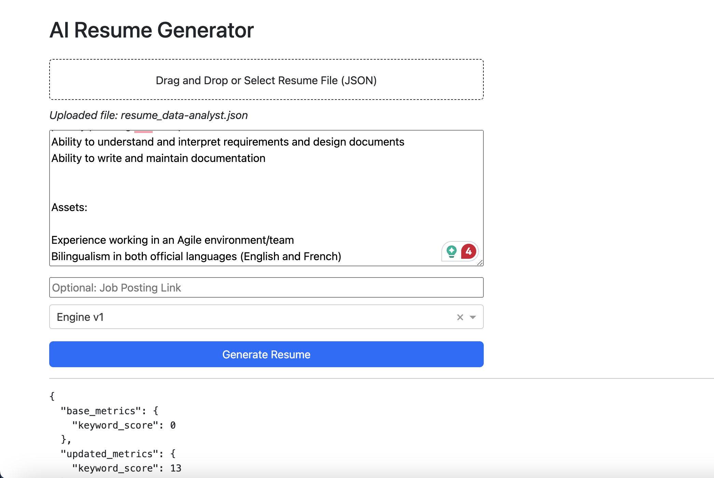

# Build your resume once ONLY!!
"Enhance" your experience to increase your chances of landing interviews, while saving valuable time for side projects and learning.

---


---


## Auto Resume
This repository seeks to harness the capabilities of ChatGPT in generating more captivating and job description-targeted resumes from your base resume. I realized that the conversion rate from sending resumes to securing interviews was exceedingly low (around 2-3% per 100 applications). Enhancing your chances of an interview requires tailoring your resume to match the job description (e.g., incorporating relevant keywords like 'Python' for a python developer role). I found this "resume-fitting" task to be extremely annoying and meaningless. As a software developer, you'd likely prefer to devote your time to creating your next impactful project to address real-world issues—utilizing your software engineering skills to improve the lives of others.

Consequently, I am motivated to develop a solution that amplifies the likelihood of landing an interview while preserving every developer's valuable time.

## Development journey
The very first version of this project started with a fully automated approach: given a job description and a base resume, the system would automatically generate a tailored resume using ChatGPT. While this automation was promising, I quickly realized that many of the generated bullet points lacked coherence or relevance. It often required manual intervention to fix and verify them.

To address this, I built a Dash app that allowed version control of resumes. With this setup, I manually used the ChatGPT web interface to generate bullet points, and only saved the good ones to a local database. This gave me finer control over the output and allowed me to curate high-quality experience entries over time. However, the process involved too many steps and became too slow and inefficient—especially when applying to many jobs.

Now, I’ve shifted to a hybrid approach optimized for speed. I re-used the original command-line automation and built a lightweight web interface around it. The current version of the app only requires me to paste a job description and click a button to generate a tailored resume from my base resume. This drastically reduces the friction in the resume customization workflow while retaining some of the quality controls from earlier iterations.

# Interface mode


## Setup
Use poetry to setup the environment
```bash
poetry install
```

## Use dash app to version control your resume and experience generateion
1. Create a `.env` file with reference to `.env.sample`
2. Prepare your base resume json
2. Seed your sqlite DB
```bash
# 
python seed.py
```


## Use CLI to generate your resume automatically
1. Set the Open AI api key as environment variable
```bash
# add this line in your .zshrc / .bashrc
export OPENAI_API_KEY="your-openai-api-key"
```
2. Prepare your base resume json
Prepare a base resume in JSON. Please refer to the resume.example.json
3. Prepare the JD of your targeted job opening
Prepare a txt file containing the JD of your targeted job opening.
4. Run with the CLI
```bash
python generate_resume.py --resume your-base-resume-json.json --jd your-job-description.txt
```

## Documentation
Last update: 2023-11-17

### Agents
#### 1. jd_parsing_agent
This agent parses a given job description to extract key information: the job title, skills required, and other important keywords. The agent will use job descriptions as input and format the extracted data into a dict.

**job_description**: str, the actual job description.

#### 2. keyword_injecting_agent
This agent enhances a set of job experiences by incorporating specific keywords derived from a job description. The goal is to make the experiences more tailored to the job description provided. The agent will review user's experiences, selecting relevant keywords, and then rewriting those experiences with the chosen keywords.

**experiences**: str, the user's job experiences.
**keywords**: list, the list of keywords extracted from a job description

#### 3. skill_injecting_agent
This agent revises a set of job experiences by including certain required skills. The agent aims to tailor the experiences to better fit the job requirements by including relevant skills. The agent will review the experiences, select the most relevant skills, and rewrite the experiences with these skills included.

**experiences**: str, the user's job experiences.
**skills**: str, the list of required skills.

#### 4. experience_enhancing_agent
This agent enhance job experiences provided from a user's job history. The objective is to refine these experiences according to specified criteria to potentially better reflect the user's accomplishments and skills. The agent ensures the experiences are action-oriented, job duty clear, skill-inclusive, and achievement-focused with quantifiable outcomes.

**experiences**: str, the user's job experiences.


### Interaction logic of agents
The `engine_v1.py` employs a multi-agent system to refine a user's resume according to a given job description. The `start()` method encapsulates the logic of building the resume and the `create_agents()` method initializes all agents. Here's how the agents interact and contribute to the resume enhancement process:

#### 1. Initialization:
All agents are initialized with the same LLM (Language Model) configuration.

#### 2. Job Description Parsing:
The JdParsingAgent reads the job description and extracts essential details like required skills and keywords.

#### 3. Skill Injection:
For each job experience in the base resume, the SkillInjectingAgent incorporates relevant skills from the job description into the job experience description.

#### 4. Keyword Injection:
Subsequently, the KeywordInjectingAgent incorporates relevant keywords from the job description into the enhanced job experience description.

#### 5. Experience Enhancement:
Lastly, the ExperienceEnhancingAgent further refines the job experience descriptions by ensuring they are action-oriented, clear, skill-inclusive, and achievement-focused with quantifiable outcomes.

#### 6. Resume Update and Output:
The updated job experiences are collated and used to update the original base resume.
A utility function `create_resume()` is then employed to format the updated resume into a docx file, which is saved to the specified output file path.


## References
1. Canadian resume template; https://zety.com/blog/canadian-resume


## Feedback and Contributions
Your feedback on the quality and effectiveness of this solution is highly appreciated. I am eager to learn and improve from your insights! Additionally, feel free to make pull requests—let's collaborate to enhance the hiring process together!

## Planned Features

| User Story | Feature | Acceptance Criteria | Status |
|------------|---------|----------------------|--------|
| As a frequent user of the resume generation dashboard, I want to have the system load a default base resume automatically, so that I don't need to manually drag and drop the same file every time I generate a resume. | Automatically use a default base resume if none is uploaded. | - If no base resume is uploaded, the app uses a predefined file (e.g., `./data/base_resume.json`).<br>- If a resume is uploaded, it overrides the default.<br>- The UI indicates which resume is being used. | Planned |
| As a user of the resume generation dashboard, I want to see the download button only after the resume is successfully generated, so that I’m not confused by an inactive or premature download option. | Only show the Download Resume button after generation completes. | - "Download Resume" button is hidden by default.<br>- Button appears after resume generation completes.<br>- (Optional) A confirmation message is shown. | Planned |
